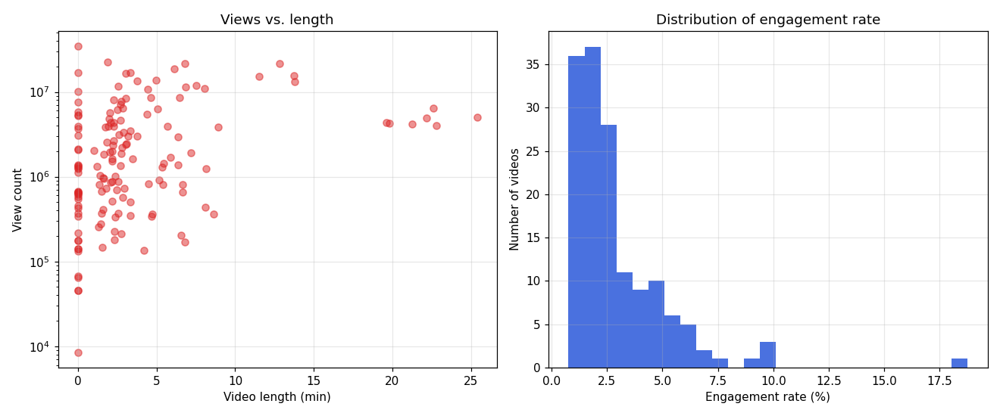

# BuzzFeed YouTube Metrics Analysis

Extract, analyze, and visualize YouTube performance metrics for BuzzFeed's
channels — built around "North Star" metrics (views, engagement rate, watch time)
and the relationships between them.



## Components

| File | Purpose |
|---|---|
| `yt-analysis.py` | Pull every video for a channel via the YouTube Data API v3 (paginated, batched 50/call) and save metrics to Excel |
| `analyze.py` | Derive engagement metrics, print a summary, and render charts — **runs offline from the Excel, no API key needed** |
| `buzzfeed_youtube_metrics.xlsx` | Extracted raw metrics (150 videos) |
| `BuzzFeed YouTube Analysis.twb` | Tableau workbook with the interactive dashboard |

## North Star metrics

- **View count** — popularity and reach
- **Engagement rate** — `(likes + comments) / views`, how actively viewers interact
- **Watch time / length** — how engaging and relevant the content is

## Quick start

### Analyze the existing data (no API key)

```bash
python3 -m venv .venv && source .venv/bin/activate
pip install -r requirements.txt
python analyze.py          # prints summary + writes figures/engagement.png
```

Example output:

```
Videos analyzed:        150
Total views:            592,721,828
Mean engagement rate:   2.93%
Median length:          2.3 min
Corr(length, views):    +0.23
```

### Re-extract fresh data from YouTube

```bash
cp .env.example .env       # add your YOUTUBE_API_KEY and channel ID(s)
python yt-analysis.py      # writes buzzfeed_youtube_metrics.xlsx
```

Get an API key from the [Google Cloud Console](https://console.cloud.google.com/)
(enable "YouTube Data API v3"). The key is read from `.env` and never committed.

## What changed from the original class version

- Video details fetched in **batches of 50** (was one API call per video) — far less quota use
- **Pagination** added (was capped at the first 50 results)
- ISO-8601 durations parsed to **real seconds** (was storing the raw `PT#M#S` string)
- Dropped the dead `Dislike Count` field (YouTube removed public dislikes in 2021)
- Config + secrets via `.env`; added `requirements.txt`
- New `analyze.py` adds the analysis layer in Python (engagement rate, summaries, charts)

## Notes & credits

Original data-analytics project by Abdallah Dalis. Uses the public YouTube
Data API v3.
